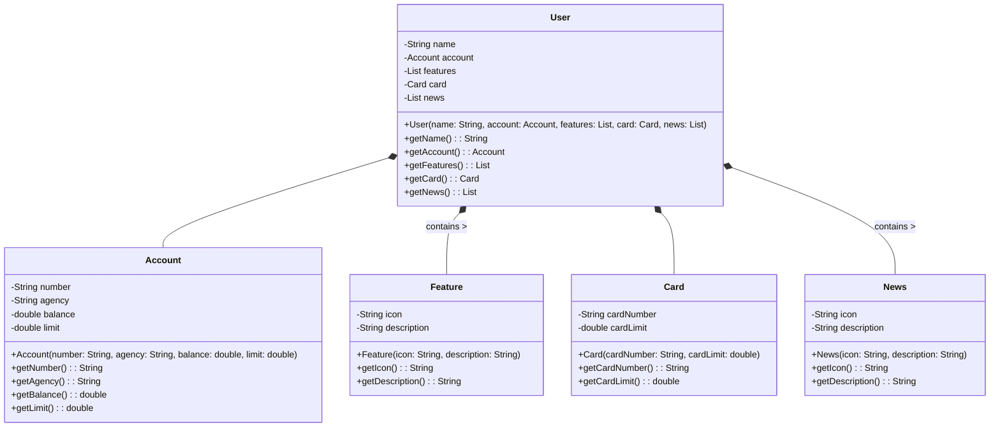

# Projeto RESTful API Spring Boot
Repositório criado para armazenar um projeto Java com Spring Boot.

```mermaid
classDiagram
  class User {
    -String name
    -Account account
    -List<Feature> features
    -Card card
    -List<News> news
    +User(name: String, account: Account, features: List<Feature>, card: Card, news: List<News>)
    +getName(): String
    +getAccount(): Account
    +getFeatures(): List<Feature>
    +getCard(): Card
    +getNews(): List<News>
  }
  
  class Account {
    -String number
    -String agency
    -double balance
    -double limit
    +Account(number: String, agency: String, balance: double, limit: double)
    +getNumber(): String
    +getAgency(): String
    +getBalance(): double
    +getLimit(): double
  }
  
  class Feature {
    -String icon
    -String description
    +Feature(icon: String, description: String)
    +getIcon(): String
    +getDescription(): String
  }
  
  class Card {
    -String cardNumber
    -double cardLimit
    +Card(cardNumber: String, cardLimit: double)
    +getCardNumber(): String
    +getCardLimit(): double
  }
  
  class News {
    -String icon
    -String description
    +News(icon: String, description: String)
    +getIcon(): String
    +getDescription(): String
  }
  
  User *-- Account
  User *-- Feature : contains >
  User *-- Card
  User *-- News : contains >
```
